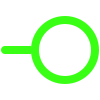

# Hi there 👋🏻 I'm Mohammad
### Embedded Systems Engineer | Firmware Developer | C/C++
#### I design embedded systems that bridge software and hardware with a focus on efficient, low-level programming and reliable system design.
#
#### MoveAZi Studio ,Where embedded ideas turn into real systems   
###      <a href="https://www.moveazi.com" target="_blank"> <big><big>moveazi.com<big><big></a> 
#
 

  
  
  
  

<!--
**Mohamadkhosravi/Mohamadkhosravi** is a ✨ _special_ ✨ repository because its `README.md` (this file) appears on your GitHub profile.

Here are some ideas to get you started:

- 🔭 I’m currently working on Aravan Share Company 
- 🌱 I’m currently learning Embedded Linux 
- 👯 I’m looking to collaborate on ...
- 🤔 I’m looking for help with ...
- 💬 Ask me about ...
- 📫 How to reach me: ...
- 😄 Pronouns: ...
- ⚡ Fun fact: ...
-->

 
<!--
**Mohamadkhosravi/Mohamadkhosravi** is a ✨ _special_ ✨ repository because its `README.md` (this file) appears on your GitHub profile.

Here are some ideas to get you started:

- 🔭 I’m currently working on Aravan Share Company 
- 🌱 I’m currently learning Embedded Linux 
- 👯 I’m looking to collaborate on ...
- 🤔 I’m looking for help with ...
- 💬 Ask me about ...
- 📫 How to reach me: ...
- 😄 Pronouns: ...
- ⚡ Fun fact: ...
-->
